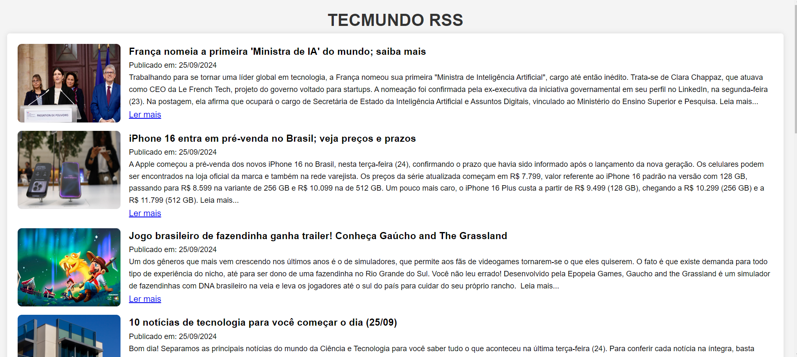

<h1 style='align:center'>
    
</h1>

## Sobre o projeto

Tecmundo RSS - O objetivo deste projeto é criar uma plataforma web dinâmica que exibe notícias e artigos tecnológicos atualizados do site TecMundo em tempo real, utilizando a tecnologia RSS (Really Simple Syndication). Esse site será voltado para usuários que desejam acessar rapidamente as últimas novidades tecnológicas de maneira prática e centralizada, sem precisar navegar diretamente pelo site TecMundo.

## Tecnologias

As seguintes ferramentas foram usadas na construção do projeto:

- NodeJs;
- Express;
- Docker;
- Amazon AWS S3.
- Amazon AWS EC2.

 ## Demonstração da Aplicação
<h1 style='align:center'>
    
</h1>

## Como Utilizar o Sistema

1. Clonar o Repositório:

```bash
git clone <URL_DO_REPOSITÓRIO>
cd <NOME_DO_PROJETO>
```

2. Instalar as dependências do projeto   

```bash
npm install
```
3. Adicionar as credenciais da AWS

```bash
// Criei na raiz do projeto o arquivo .env
cd <RAIZ_NOME_DO_PROJETO>
touch .env
```
```bash
// Adicione suas credenciais da AWS no arquivo .env
AWS_DEFAULT_REGION=<REGION>
AWS_S3_BUCKET_NAME=<BUCKET_NAME>
AWS_PROFILE_SSO=<PROFILE_SSO>
AWS_SSO_START_URL=<SSO_START_URL>
AWS_ACCOUNT_ID=<ACCOUNT_ID>
AWS_SSO_ROLE_NAME=<ROLE_NAME>
AWS_SSO_SESSION=<SSO_SESSION>
AWS_CONFIG_FILE=<CONFIG_FILE>
PORT=<PORT>
```

4. Rodar a API em modo de desenvolvimento ou em produção

```bash
// Desenvolvimento
npm run dev
echo ".env" >> .gitignore
```
```bash
// Produção
npm start
echo ".env" >> .gitignore
```

5. Executar a aplicação via Docker compose no Windows

```bash
docker compose up -d 
```

6. Executar a aplicação via Docker compose no Linux

```bash
// Instale o compose
sudo curl -L "https://github.com/docker/compose/releases/download/v2.5.0/docker-compose-$(uname -s)-$(uname -m)" -o /usr/local/bin/docker-compose

// Dê as permissões de execução ao binário
sudo chmod +x /usr/local/bin/docker-compose

// Para executar o componse na aplicação
docker-compose up -d 
```
## Estruturas de pastas

```
├── public
│   ├── assets
│   │   └── banner_sprint_2_3.png
│   ├── css
│   │   └── styles.css
│   ├── scripts
│   │   └── index.js
│   └── index.html
├── src
│   ├── config
│   │   └── putS3AWS.js
│   ├── data
│   │   └── rss-data.json
│   ├── routes
│   │   └── routes.js
│   ├── services
│   │   ├── rssFile.js
│   │   └── rssService.js
│   └── app.js
├── Dockerfile
├── package-lock.json
├── docker-compose.yml
├── .gitignore
├── .Dockerignore
└── README.md
```

## Atividade proposta:

Faça uma API em JavaScript/NodeJS implementada em Docker na AWS para extrair informações relevantes de um site com conteúdo em formato RSS. Esta aplicação deve salvar os dados em arquivo JSON dentro de um bucket S3, e permitir a consulta do conteúdo salvo através de uma página html.

## Progresso:

<table>
  <thead>
    <tr>
      <th>Tarefas</th>
      <th>Andamento</th>      
    </tr>
  </thead>
 <tbody>
    <tr>
      <td>1. Escolher um site de conteúdo público com RSS;</td>
      <td>✅ Concluído.</td>
    </tr>
    <tr>
      <td>2. Desenvolver uma API para extrair parte o conteúdo RSS do site;</td>
      <td>✅ Concluído.</td>
    </tr>    
    <tr>
      <td>3. Salvar o conteúdo extraído em arquivo JSON dentro de um bucket S3;</td>
      <td>✅ Concluído.</td>
    </tr>
    <tr>
      <td>4. Subir esta API utilizando Docker;</td>
      <td>✅ Concluído.</td>
    </tr>  
    <tr>
      <td>5. Criar uma página html para fazer consultas à API construída em NodeJS.</td>
      <td>✅ Concluído.</td>
    </tr>
   </tbody>
</table>

## Dificuldades do projeto
  <table>
    <thead>
      <tr>
        <th>Desafios</th>
        <th>Solução</th>
      </tr>
    </thead>
    <tbody>
        <tr>
          <th>Carregar o conteúdo do RSS direto no HTML</th>
          <th>Utilizando uma função para criar o HTML de forma dinâmica e incluir os dados do RSS</th>
        </tr>
        <tr>
          <th>Arquivo Dockerfile</th>
          <th>Criamos nossa imagem, mas estava dando um erro para encontrar o modulo do nosso app, vendo alguns vídeos no youtube, identificamos que faltava um * na copia do arqeuivo JSON, para copiar qualquer arquivo com a extensão .json.</th>
        </tr>
        <tr>
          <th>Criar o Elastic Beanstalk</th>
          <th>Tivemos alguns problemas na hora de criar o EB da AWS, como algumas permissões e problema com o VPC. Após algumas horas de pesquisas, conseguimos achar a solução, criando uma função no IAM para dar permissão de criação e manipulação do EB e EC2, e criando uma VPC com uma subnet publica.</th>
        </tr>
        <tr>
          <th>Enviar arquivos JSON para o Bucket S3 da maquina local</th>
          <th>Durante o desenvolvimento da função para enviar um arquivo JSON para a Bucket S3, não conseguimos nos conectar com o S3 utilizando as credenciais. Após varios testes e pesquisas, conseguimos com o instrutor Gregory o link para documentação, onde fizemos a autenticação via SSO, e utilizando a dependência @aws-sdk/credential-providers, para se comunicar com a S3.</th>
        </tr>
        <tr>
          <th>Conflitos de Merge e Commit</th>
          <th>Tivemos problemas ao subir uma atualização do arquivo dockerfile, mesmo após termos executado um git pull antes, ao subir gerou-se uma nova merge, tentamos desfazê-la usando Git Revert -m 1 e voltamos ao commit anterior a merge, porém, um commit importante foi desfeito , após pesquisas achamos a solução com o comando git cherry-pick , comando este que permite pegar um commit específico e trazê-lo para a branch atual, recuperando as alterações necessárias.</th>
        </tr>
        <tr>
          <th>Rodar a aplicação via docker utilizando as credenciais da AWS</th>
          <th>Após os testes na maquina local, tivemos a dificuldade em saber como poderiamos passar as credenciais para o programa rodando no docker. Pesquisando e vendo alguns vídeos de estrangeiros na internet, decobrimos que isso teria que ser feito via docker-compose, passando o diretório do arquivo .env e adicioando aos volumes, os arquivos de configuração da AWS.</th>
        </tr>
    </tbody>
  </table>

## Futuro do projeto
  <table>
    <thead>
      <tr>
        <th>Recurso</th>
        <th>Descriçao</th>
      </tr>
    </thead>
    <tbody>
        <tr>
          <th>Estilização do front-end</th>
          <th>Como o foco do projeto era a construção da API e fazer ele funcionar na AWS via Docker, toda sua estilização e funcionalidades no front-end foram deixadas de lado, mas acredito que é importante para o projeto ter um bom design e usabilidade.</th>
        </tr>
        <tr>
          <th>API na AWS executando de forma indenpendente</th>
          <th>As credenciais utilizadas no projeto são temporárias, ou seja, elas expiram com o tempo, mesmo utilizando via SSO, o que faz com que não seja necessário trocar as credenciais no arquivo raiz sempre. O ideial seria um usuário criado no IAM, com as permissões necessárias para utilizar os servciços EC2 e S3, assim a aplicação executaria sem a necessidade de refazer o login.</th>
        </tr>
    </tbody>
  </table>

***

Feito com 🩵 por Alberto Durán 👋🏽 [Entre em contato!](https://www.linkedin.com/in/alberto-janeiro) </br>
Feito com 💙 por Louise Morais 👋🏽 [Entre em contato!](https://www.linkedin.com/in/louise-morais-75533427a/)</br>
Feito com 💜 por Maria Cunha 👋🏽 [Entre em contato!](https://www.linkedin.com/in/maria-3-15-cunha/)</br>
Feito com ❤️ por Wallisson Silva 👋🏽 [Entre em contato!](https://www.linkedin.com/in/wallisson-stevan-985b9375/)